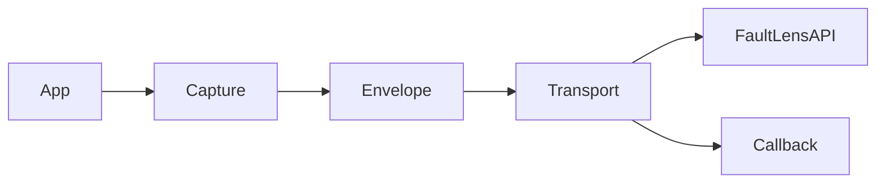
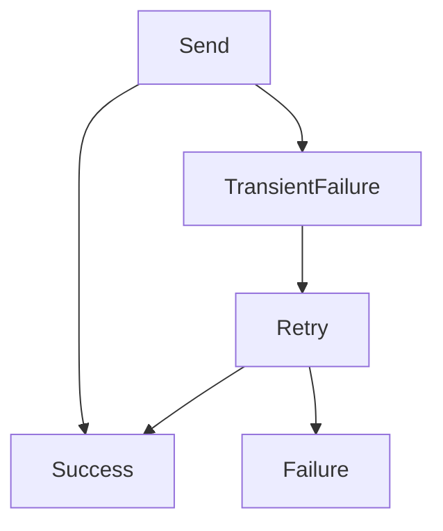
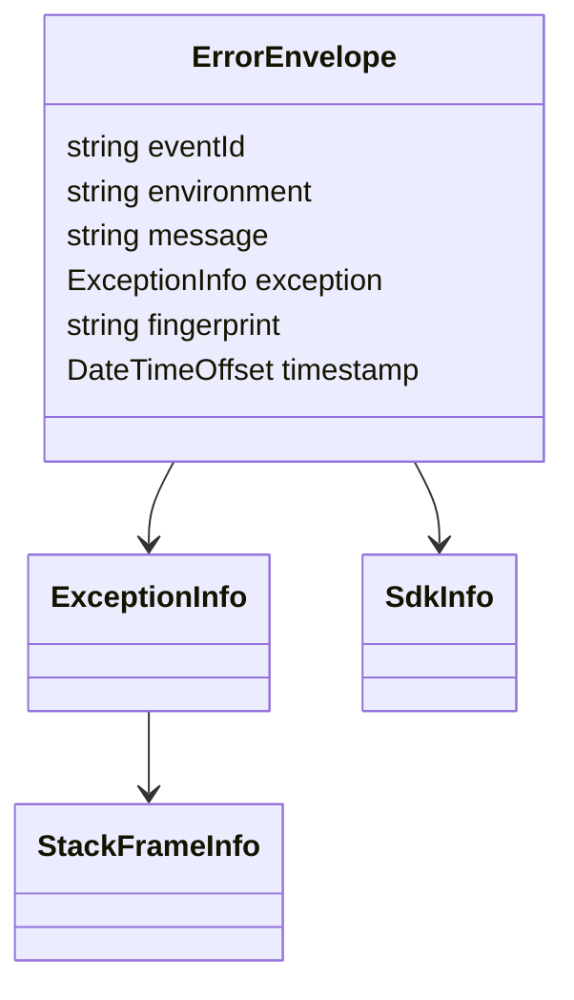

# FaultLens .NET SDK (v1)

FaultLens SDK provides **fire-and-forget error tracking** for .NET applications.

The SDK is designed to be:
- Safe by default
- Non-blocking
- Dependency-light
- Production-ready

This document **locks the SDK contract for v1**.

---

## Installation

```bash
dotnet add package FaultLens.Sdk
```
## Initialization
```csharp
var options = new FaultLensOptions(
    apiKey: "YOUR_PROJECT_API_KEY",
    environment: "production",
    release: "1.0.0");

var client = new FaultLensClient(
    options,
    new HttpEventTransport(
        new HttpClient { BaseAddress = options.Endpoint }),
    new SdkInfo());
```

## Capturing Exceptions

```csharp
try
{
    throw new InvalidOperationException("Something broke");
}
catch (Exception ex)
{
    client.CaptureException(ex, result =>
    {
        if (!result.Success)
        {
            Console.WriteLine($"FaultLens delivery failed: {result.ErrorCode}");
        }
    });
}
```

## Capturing Messages

```bash
client.CaptureMessage("Unexpected state reached");
```

## Delivery semantics (Authoritative)

- Capture methods never throw
- Capture methods never block
- Events are delivered asynchronously
- Failures do not affect application flow
- Callback is optional and advisory


## DeliveryResult

```csharp
public sealed class DeliveryResult
{
    public bool Success { get; }
    public string ErrorCode { get; }
    public string ErrorMessage { get; }
}
```
## Possible `ErrorCode` values:

- `network_error`
- `rate_limited`
- `unauthorized`
- `serialization_failed`
- `unknown`

## Retry Behavior
- Automatic retries for transient failures
- Max retries: 3
- Exponential backoff with jitter
- No retries for permanent failures


## Error Envelope (Canonical)


## Event Identity
- SDK generates a client-side eventId
- Backend generates the authoritative event ID
- SDK eventId is used for:
     - Client-side correlation
     - Retry tracking
     - Debugging

## Guarantees

- SDK is safe to call from any thread
- SDK never throws user-visible exceptions
- SDK does not block application execution
- SDK does not expose backend internals
- SDK behavior is deterministic

## Non-Goals (v1)

- Guaranteed delivery
- Synchronous acknowledgements
- Persistent queues
- Circuit breakers
- Configurable retry policies

## Compatibility

- Target framework: `netstandard2.1`
- C# language version: `8.0`
- No ASP.NET Core dependencies
- No Polly
- No IHttpClientFactory